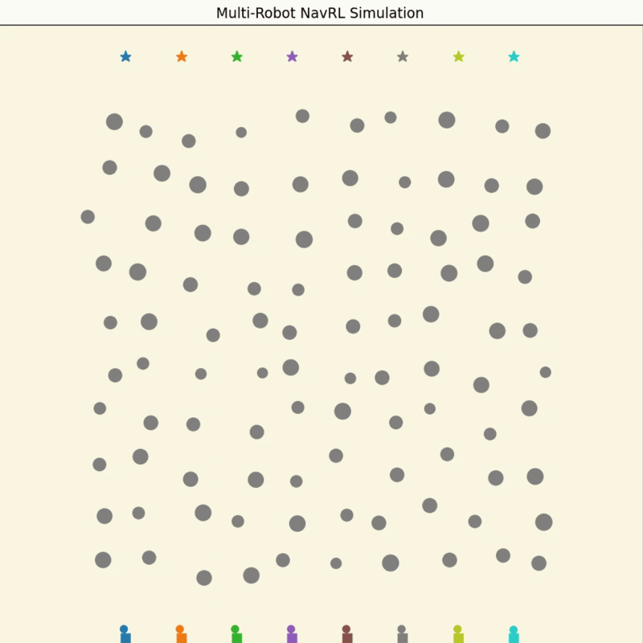

# 基于强化学习与安全屏蔽的无人机动态环境自主导航方法研究

本仓库为《高级机器学习理论》课程项目代码仓库，研究主题为“基于强化学习与安全屏蔽的无人机动态环境自主导航方法研究”。

仓库包含三部分核心内容：

1. `quick-demos/`：基于预训练策略的快速演示
2. `isaac-training/`：基于 Isaac Sim 的强化学习训练代码
3. `ros1/`：基于 ROS1 与 Gazebo 的仿真部署代码

## 仓库结构说明

```text
.
├─ isaac-training/   # Isaac Sim 训练环境、任务配置和安装脚本
├─ quick-demos/      # 简单演示脚本、推理代码和预训练 checkpoint
├─ ros1/             # ROS1/Gazebo 仿真部署代码
├─ media/            # 仓库内保留的 quick demos 展示资源
├─ LICENSE
└─ README.md
```

`ros1/` 为完整的 ROS 工程，按功能拆分为多个 package：

- `ros1/uav_simulator/`：Gazebo 场景、模型、世界文件和无人机仿真
- `ros1/navigation_runner/`：导航策略、安全屏蔽和运行入口
- `ros1/map_manager/`：地图与碰撞查询模块
- `ros1/onboard_detector/`：动态障碍感知相关模块

这些目录都和最终的仿真运行直接相关，不是无关文件。

## 一、简单演示怎么运行

简单演示使用 `quick-demos/` 下的预训练模型，不依赖 ROS，可直接用于快速查看导航效果。

## NavRL Quick Demos in 3 Minutes

Quick demos 展示如下，用于说明预训练策略在不同场景下的导航效果。

<table>
  <tr>
    <td></td>
    <td></td>
    <td></td>
  </tr>
</table>

### 环境建议

- Ubuntu 20.04/22.04
- Conda / Miniconda
- Python 3.10

### 1. 创建部署环境

```bash
cd isaac-training
bash setup_deployment.sh
conda activate NavRL
```

### 2. 运行 quick demos

```bash
cd ../quick-demos

# DEMO I: 预设目标点导航
python simple-navigation.py

# DEMO II: 随机/动态目标点导航
python random-navigation.py

# DEMO III: 多机器人导航
python multi-robot-navigation.py
```

三个脚本分别对应：

- `simple-navigation.py`：导航到预设目标点
- `random-navigation.py`：导航到动态生成的目标点
- `multi-robot-navigation.py`：多机器人场景演示

### 3. 如果需要导出 GIF

```bash
cd ../quick-demos
python simple-navigation.py --save-gif ../media/simple-navigation-local.gif --no-show
```

其中：

- `--save-gif` 用于保存演示结果
- `--no-show` 用于无界面导出

预训练模型位于：

```text
quick-demos/ckpts/navrl_checkpoint.pt
```

## 二、训练代码怎么运行

训练部分位于 `isaac-training/`，用于在 Isaac Sim 中训练强化学习导航策略。

### 环境要求

- Ubuntu 22.04
- NVIDIA GPU
- Conda / Miniconda
- Isaac Sim `2023.1.0-hotfix.1`

### 1. 设置 Isaac Sim 路径

```bash
export ISAACSIM_PATH=/absolute/path/to/isaac-sim-2023.1.0-hotfix.1
```

### 2. 安装训练环境

```bash
cd isaac-training
bash setup.sh
conda activate NavRL
```

### 3. 启动训练

```bash
cd third_party/OmniDrones/scripts
python train.py task=SafeUAVNav algo=ppo wandb.mode=disabled env.num_envs=256
```

如果希望无界面训练：

```bash
python train.py task=SafeUAVNav algo=ppo headless=True wandb.mode=disabled env.num_envs=256
```

训练任务配置位于：

```text
isaac-training/third_party/OmniDrones/cfg/task/SafeUAVNav.yaml
```

算法配置位于：

```text
isaac-training/third_party/OmniDrones/cfg/algo/ppo.yaml
```

默认训练脚本配置位于：

```text
isaac-training/third_party/OmniDrones/scripts/train.yaml
```

### 4. 本项目训练配置说明

本项目训练配置如下：

- 任务选择：`task=SafeUAVNav`
- 算法选择：`algo=ppo`
- 并行环境数：`env.num_envs=256`
- 单回合最大步数：`max_episode_length=500`
- 无人机模型：`Firefly`
- 观测展平：`ravel_obs=true`
- 动作变换：`action_transform=null`
- 奖励中的动作能耗权重：`reward_effort_weight=0.05`
- 奖励中的动作平滑权重：`reward_action_smoothness_weight=0.02`
- 距离奖励权重：`reward_distance_scale=1.0`
- PPO `train_every=32`
- PPO `ppo_epochs=4`
- PPO `num_minibatches=16`
- 默认随机种子：`seed=0`
- 默认总训练帧数：`total_frames=150_000_000`
- 默认 `headless=false`
- 默认 `wandb.mode=online`，本地训练时可改为 `wandb.mode=disabled`

如果按推荐配置运行训练，建议直接使用：

```bash
cd isaac-training/third_party/OmniDrones/scripts
python train.py task=SafeUAVNav algo=ppo env.num_envs=256 seed=0 total_frames=150000000 wandb.mode=disabled
```

如果希望不打开 Isaac Sim 窗口：

```bash
python train.py task=SafeUAVNav algo=ppo headless=True env.num_envs=256 seed=0 total_frames=150000000 wandb.mode=disabled
```

## 三、ROS1 仿真版本怎么运行

本项目提供基于 ROS1 和 Gazebo 的仿真部署流程。

### 环境要求

- Ubuntu 20.04
- ROS Noetic
- Gazebo

### 1. 安装依赖并编译 catkin 工作空间

```bash
sudo apt-get install ros-noetic-mavros*

cp -r ros1 /path/to/catkin_ws/src
cd /path/to/catkin_ws
catkin_make
```

### 2. 配置 Gazebo 模型路径

将下面这行加入 `~/.bashrc`：

```bash
source /path/to/catkin_ws/src/ros1/uav_simulator/gazeboSetup.bash
```

然后执行：

```bash
source ~/.bashrc
```

### 3. 启动仿真与导航

终端 1：

```bash
roslaunch uav_simulator start.launch
```

终端 2：

```bash
roslaunch navigation_runner safety_and_perception_sim.launch
```

终端 3：

```bash
conda activate NavRL
rosrun navigation_runner navigation_node.py
```

运行后可以在 RViz 中使用 `2D Nav Goal` 指定目标点，观察无人机在动态环境中的导航过程。

### ROS1 仿真展示视频

ROS1 仿真演示视频如下：

https://github.com/user-attachments/assets/b7cc7e2e-c01d-4e44-87e3-97271a3aaa0f
