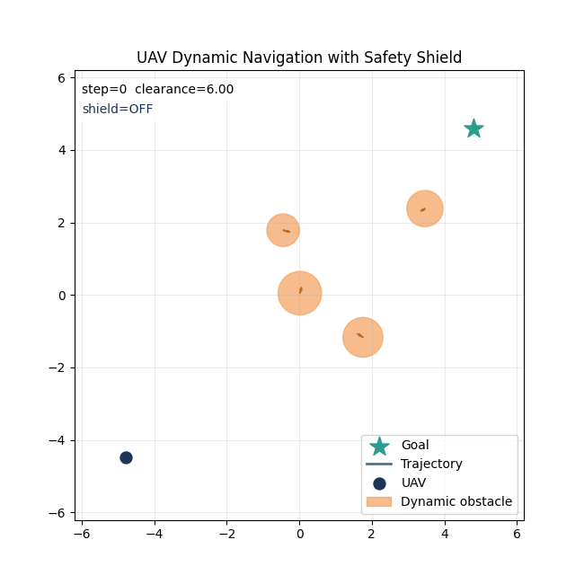

# 基于强化学习与安全屏蔽的无人机动态环境自主导航

本仓库是“高级机器学习理论”课程作业的提交版代码仓库，主题为“基于强化学习与安全屏蔽的无人机动态环境自主导航方法研究”。

仓库分成两部分：

1. `scripts/run_lite_sim.py`
   一个可直接运行的轻量级二维仿真演示，用于展示“目标驱动策略 + 安全屏蔽层”的核心思想，并可导出本地 GIF。
2. `isaac-training/`
   基于 Isaac Sim 的高保真训练代码整理版，保留了无人机导航相关环境，并补齐了本压缩包缺失的配置与依赖安装脚本。

本仓库不再保留原始外链演示视频；课程提交中仅保留本仓库可复现的仿真演示流程。



## 目录结构

```text
.
├─ assets/
│  └─ demo/                    # 本仓库保留的仿真演示结果
├─ docs/
│  └─ project_summary.md       # 课程报告撰写参考
├─ isaac-training/             # Isaac Sim 高保真训练部分
├─ scripts/
│  ├─ run_lite_sim.py          # 轻量级动态环境+安全屏蔽演示
│  └─ train_isaac_nav.sh       # Isaac Sim 训练入口
├─ requirements-lite.txt       # 轻量级演示依赖
└─ NOTICE.md                   # 开源来源与改动说明
```

## 快速开始

### 方案 A：先运行轻量级仿真演示

这是最推荐的启动方式，不依赖 Isaac Sim，适合课程验收时快速展示“动态障碍导航 + 安全屏蔽”的核心思路。

```bash
pip install -r requirements-lite.txt
python scripts/run_lite_sim.py
```

默认会在 `assets/demo/safe_uav_nav.gif` 生成一个仿真演示 GIF，并在终端输出：

- 是否成功到达目标
- 总步数
- 最小安全间距
- 安全屏蔽触发次数

如果你想自定义输出路径：

```bash
python scripts/run_lite_sim.py --save-gif assets/demo/my_demo.gif
```

### 方案 B：运行 Isaac Sim 高保真训练版本

这部分适合在 Ubuntu + Conda + NVIDIA Isaac Sim 环境下做更高保真的训练与展示。

#### 环境要求

- Ubuntu 22.04
- Conda / Miniconda
- NVIDIA GPU
- Isaac Sim `2023.1.0-hotfix.1`

#### 1. 设置 Isaac Sim 路径

```bash
export ISAACSIM_PATH=/absolute/path/to/isaac-sim-2023.1.0-hotfix.1
```

#### 2. 安装环境

```bash
cd isaac-training
bash setup.sh
conda activate aml_safe_nav
```

#### 3. 启动导航训练

回到仓库根目录后执行：

```bash
bash scripts/train_isaac_nav.sh
```

默认参数：

- 任务：`SafeUAVNav`
- 算法：`PPO`
- `wandb.mode=disabled`
- 并行环境数：`256`

如果你希望改成无界面训练：

```bash
HEADLESS=true bash scripts/train_isaac_nav.sh
```

如果你希望手动指定并行环境数和训练帧数：

```bash
NUM_ENVS=128 TOTAL_FRAMES=1000000 bash scripts/train_isaac_nav.sh
```

### 直接使用原始训练脚本

如果你想手工传 Hydra 参数，也可以直接运行：

```bash
cd isaac-training/third_party/OmniDrones/scripts
python train.py task=SafeUAVNav algo=ppo wandb.mode=disabled env.num_envs=256
```

## 方法说明

本仓库对应的课程项目思路是：

1. 使用强化学习策略输出名义动作，用于驱动无人机向目标点导航。
2. 在动作执行前额外加入安全屏蔽层，对可能导致碰撞的动作进行预测性修正。
3. 在动态障碍环境中同时兼顾到达目标与安全约束。

其中：

- 轻量级演示脚本主要用于可复现展示安全屏蔽机制；
- Isaac Sim 部分用于更高保真的训练与导航实验。

## 与原始压缩包相比的整理内容

- 重写了课程作业版 README
- 补齐了 `SafeUAVNav` 任务配置
- 增加了 `PPO` 配置文件，便于单无人机任务训练和保存 checkpoint
- 修复了原压缩包中缺失 `third_party/tensordict`、`third_party/rl` 导致的安装脚本失效问题
- 去掉了与课程提交无关的外链演示和第三方文档资源
- 新增了一个无需 Isaac Sim 的轻量级安全屏蔽仿真演示

## 已知说明

- 这份下载包本身并不完整，原 README 中提到的 `quick-demos/`、`media/`、ROS1/ROS2 部分未包含在压缩包里。
- 因此本仓库聚焦于当前真正可交付的导航训练代码与课程演示代码。
- `setup.sh` 中的 TorchRL / TensorDict 版本是根据当前代码结构与公开 wheel 元数据整理的兼容方案，若你的 Isaac Sim 环境自带 PyTorch 版本不同，可能需要按本机环境微调。

## 课程报告建议

课程报告可以围绕以下几点展开：

1. 动态环境无人机导航的难点
2. 强化学习名义策略与安全屏蔽层的职责分工
3. 轻量级仿真和高保真 Isaac Sim 两级实验设计
4. 成功率、碰撞率、最小安全距离、屏蔽触发次数等评价指标

更详细的撰写提纲见 [docs/project_summary.md](docs/project_summary.md)。

## 开源来源说明

本仓库是课程作业整理版，不是对上游开源代码来源的隐藏或替代。相关来源、许可证与本次整理改动见 [NOTICE.md](NOTICE.md)。
